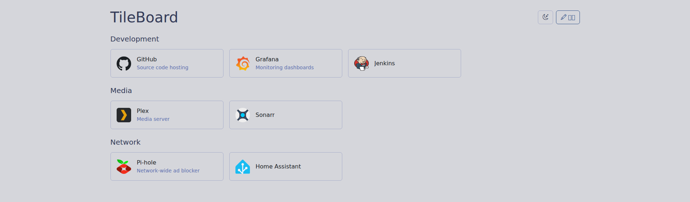
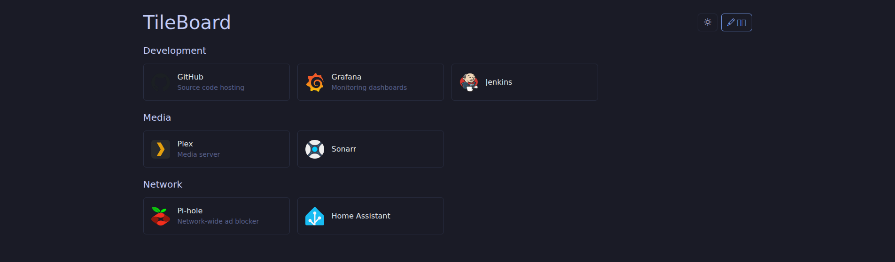

# TileBoard

セルフホスト型のカードダッシュボードです。設定はYAMLファイルで管理し、Web UI上での編集内容がそのままファイルへ書き戻されます。

> **Status: Early development.** APIやYAMLのスキーマは今後変更される可能性があります。

## 目次

- [特徴](#特徴)
- [スクリーンショット](#スクリーンショット)
- [技術スタック](#技術スタック)
- [使い方](#使い方)
- [ビルド](#ビルド)
- [ディレクトリ構成](#ディレクトリ構成)
- [ライセンス](#ライセンス)

## 特徴

- カード形式のダッシュボードUI（React + Bootstrap）
- Web UI上でグループ・カードの追加/編集/削除、ドラッグ&ドロップによる並び替えが可能
- 今後のカード種別（ウィジェット等）追加を見据えた拡張可能な設計
- 認証機能はなし（信頼できるネットワーク内での利用を想定）

## スクリーンショット

| ライトモード | ダークモード |
| --- | --- |
|  |  |

## 技術スタック

- フロントエンド: React, Vite, Bootstrap (react-bootstrap)
- バックエンド: [Hono](https://hono.dev/)
- パッケージ管理: pnpm (workspace)

## 使い方

```bash
git clone https://github.com/yuuraaa/TileBoard.git
cd TileBoard
docker compose -f docker/compose.yaml up
```

起動後、`http://localhost:5173`（frontend、`/api`はbackendにプロキシ）または`http://localhost:3000`（backend）にアクセスします。

### 編集モード

画面右上の「編集」ボタンを押すと編集モードに入り、以下の操作ができます。

- グループの追加・編集・削除
- カードの追加・編集・削除
- グループ・カード単位でのドラッグ&ドロップによる並び替え

「保存」を押すと編集内容が保存されます。「キャンセル」を押すと編集内容は破棄され、保存前の状態に戻ります。

## ビルド

本番用イメージは、リポジトリルートをDocker build contextとして指定してビルドします。

```bash
docker build -f docker/Dockerfile -t tileboard .
```

## ディレクトリ構成

```
.
├── frontend/   # React + Vite フロントエンド
├── backend/    # Hono バックエンド（APIとSPA配信）
├── data/       # 設定データ（本番はコンテナにボリュームマウントして永続化する想定）
├── docker/     # Dockerfile / compose.yaml
└── docs/       # README用の画像など
```

## ライセンス

[MIT](./LICENSE)
